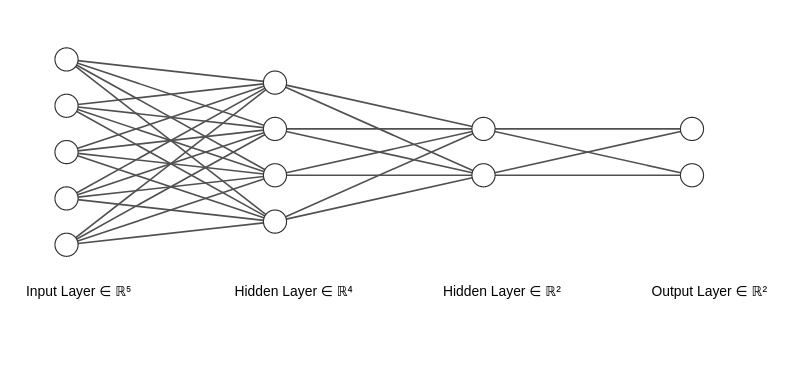
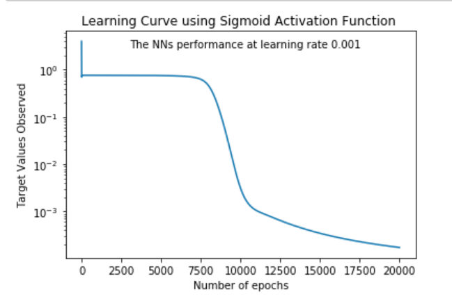
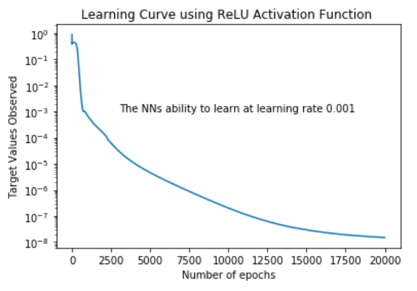

# Neural-Network-from-Scratch

Context:
To demonstrate my knowledge of Neural Networks, I created a Neural Network that trained and tested data without the help of built in Python packages. 

Project:
The Neural Network used dummy data with 5 input features, 2 hidden layers, and 2 output features. Weights and Bias were randomly selected. Feed forward and back propogation algorithms were utilized in separate code. The sigmoid and relu activation functions were both tested and gradient descent employed to optimize the SSR value. 

Image: Neural Network Structure

Results: With the right learning rate and additional epochs, quite naturally the algorithms is able to find the a better minimun as it moves through the gradient decent. Overall, the sigmoid function is not as good as the reLU activation function in this case because it provided more accurate predictions.

Image: 

